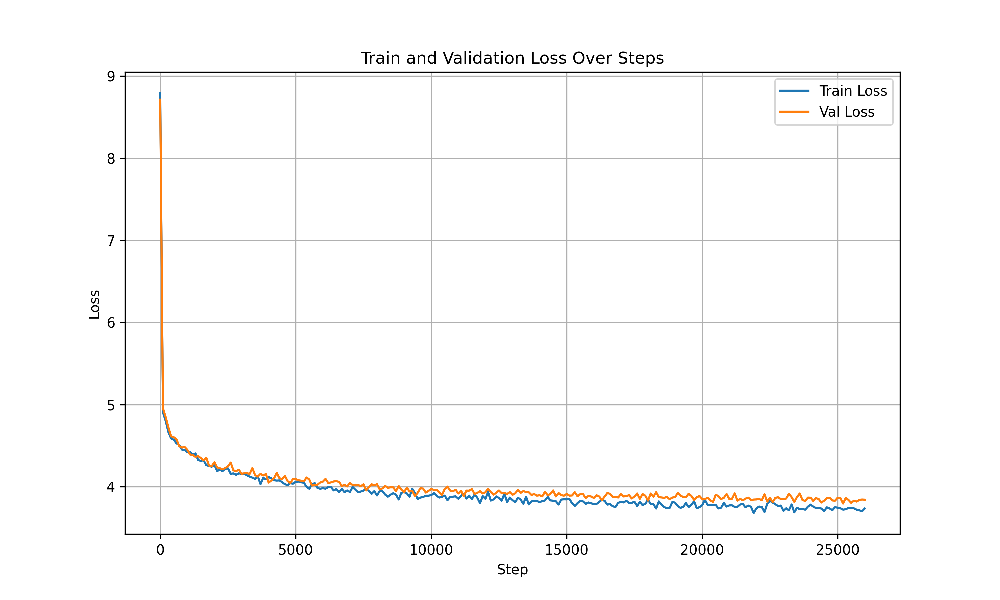

# nlp-project

Данный проект основан на статье https://arxiv.org/abs/2404.08634. \
В статье описан метод inheritune, который заключается в том, чтобы взять первые n слоев готовой обученной модели и дообучить их.\
Цель этого метода – существенно сократить количество параметров модели и вследствие этого сэкономить ресурсы\
\
Основные пункты:\
Берется уже готовая модель, архитектура и веса которой обязательно известны (в нашем случае - GPT, в статье также рассматривалась Llama)\
Можно взять разное количество слоев от готовой модели. Авторы статьи брали от 33% до 50%\
Важно, что мы не добавляем новые слои и веса, а только оптимизируем уже имеющиеся\
Дообучать модель нужно на том же датасете, на котором её учили изначально, соответственно это должна быть открытая информация. \
Датасет берется не полностью, а лишь его часть  



Веса модели - https://drive.google.com/file/d/1blPYoTcpfAaIRKp9JZk9acW7pxI5ZTSG/view?usp=sharing

Папка с кодом - src: \
model - классы моделей\
init_model - создание экземпляров моделей, передача весов из одной в другую\
config - файл с параметрами моделей и обучения\
test_model - содержит энкодер, декодер и функцию, которые позволяют проверять, что выдает модель\
train - обучение модели\
Запускать нужно файл train

---

### Notebooks

* inheritune-train - основной ноутбук, с определением модели и обучением

### Utils

В папке utils скрипты, чтобы спарсить из логов tran loss и val loss и отобразить на графике. Логи можно выгрузить, если запускать обучаться ноутбук в кагле. Логи - принты ячеек

* Чтобы спарсить loss'ы в json
```bash
cd utils
python parse.py inheritune.log parsed_logs.json
```

* Чтобы сохранить график
```bash
cd utils
python plot_losses.py parsed_logs.json loss_plot.png
```

#### Dataset

Так как нужна была лишь небольшая часть [OpenWebText](https://huggingface.co/datasets/Skylion007/openwebtext) датасета, чтобы не загружать его весь, был скачан лишь один subset: [urlsf_subset00.tar](https://huggingface.co/datasets/Skylion007/openwebtext/blob/main/subsets/urlsf_subset00.tar) распакован и собран в текстовый файл и подгружен на кагл (наверное можно было сделать иначе..)

Чтобы таким образом собрать датасет нужно:
1. Скачать [urlsf_subset00.tar](https://huggingface.co/datasets/Skylion007/openwebtext/blob/main/subsets/urlsf_subset00.tar)
2. Распаковать
```bash
tar -xf urlsf_subset00.tar 
```
3. Запустить скрипт из директории, куда распаковались файлы
```bash
python combine_dataset.py
```

Либо просто использовать весь датасет

```python
from datasets import load_dataset
dataset = load_dataset("Skylion007/openwebtext")
```
